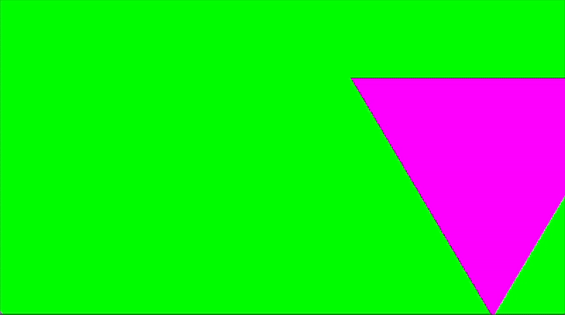
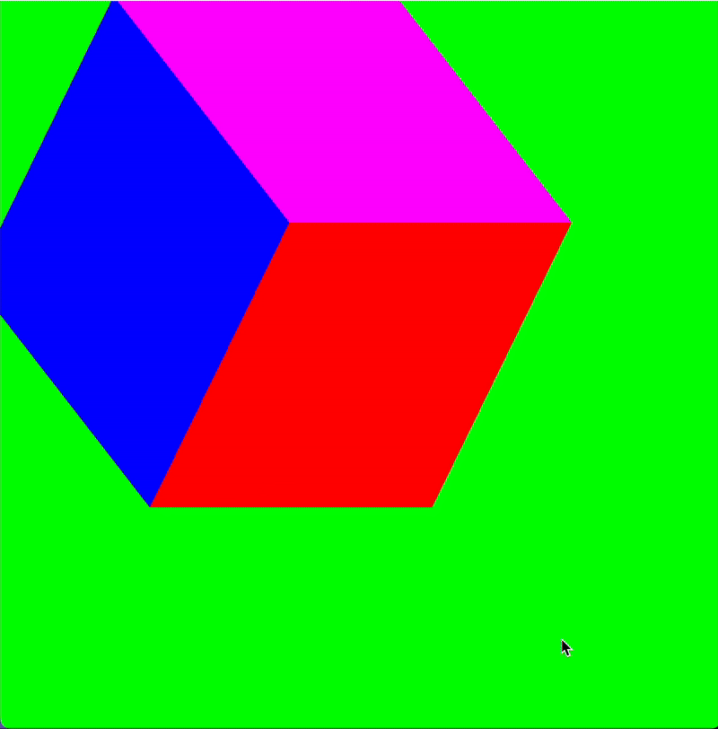

# Metal Rendering Engine

Self learning project following Dima the Programmer's [tutorial](https://youtu.be/oMdt5zWXUto?si=CnOFVobxR7C6DA5d), Kodeco's [tutorial](https://youtu.be/GLDYreVv4Ns?si=GTG41m-hsnbSbio_),  and Apple's [official Metal documentation](https://developer.apple.com/metal/cpp/).

## MS1: Animating Triangle

This is my first experience with Metal:3

**Achievements**:

1. Developed complete Metal rendering pipeline, including vertex/fragment shaders, pipeline state configuration, and command buffer management
2. Applied *indexed drawing* to efficiently draw primitives
3. Animate triangle by controlling `_timer` variable with sine wave motion
4. Implemented C++/Objective-C bridge architecture for Metal integration

**Code structure**:

- `Renderer.cpp/hpp` - Core Metal rendering logic
- `RendererAdapter` - Objective-C++ bridge for MTKView integration
- `Shaders.metal` - Vertex/fragment shaders with time-based animation
- `ViewController` - UI management and render loop coordination

  

## MS2: Rotating Cube 

In this milestone,  I expanded last milestone with depth testing in 3D.

**Achievements**:

1. Implemented 3D cube with indexed drawing (24 vertices, 36 indices)
2. Added depth buffer support and Z-buffer management
3. Created multi-colored cube with per-face colors
4. Developed 3D transformation pipeline with dual-axis rotation matrices

**Key improvements** from MS1:

- 2D → 3D geometry with proper depth testing
- Matrix transformations for real-time rotation

  

